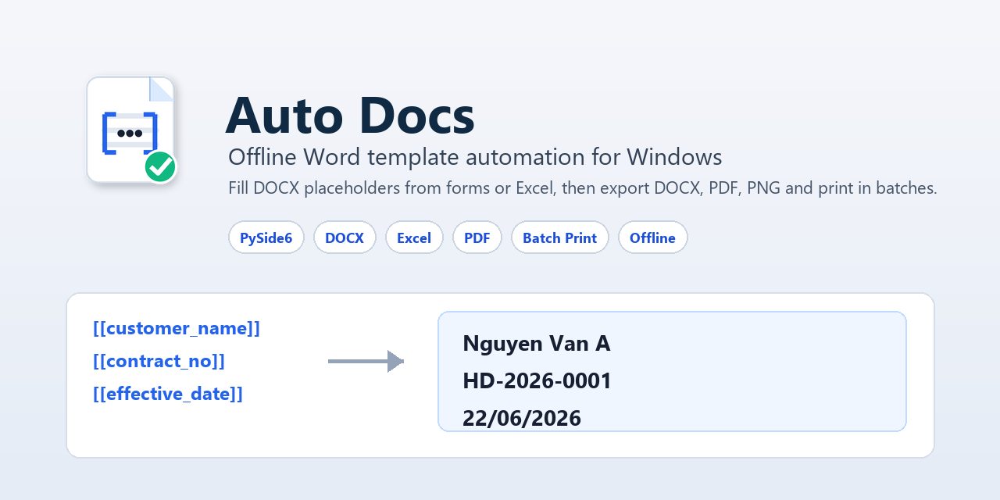
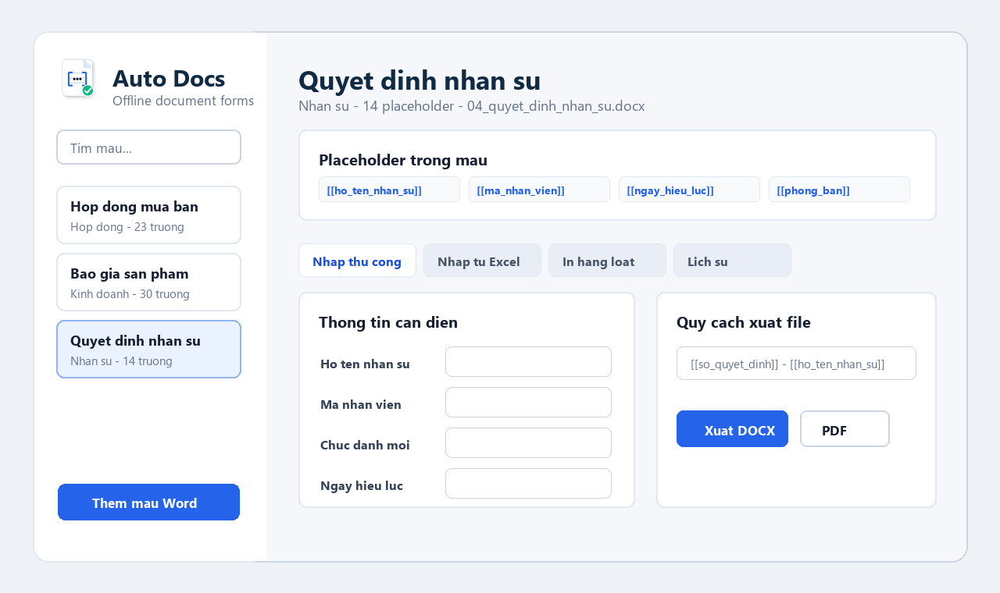

<p align="center">
  
</p>

<h1 align="center">Auto Docs</h1>

<p align="center">
  <strong>Offline Windows desktop app for generating documents from Word templates.</strong>
</p>

<p align="center">
  <a href="https://github.com/ts4m97/Auto-Docs/actions/workflows/build-windows.yml"></a>
  
  
  
  
</p>

Auto Docs turns `.docx` files into reusable forms. It scans placeholders like
`[[customer_name]]`, lets users fill data manually or from Excel, then exports
documents in DOCX/PDF/PNG formats. Everything runs offline on Windows.

<p align="center">
  
</p>

## Highlights

| Area | What Auto Docs does |
|---|---|
| Word templates | Import `.docx` files and scan placeholders written as `[[field_name]]`. |
| Form filling | Generate a friendly input form from detected placeholders. |
| Excel batch | Create Excel samples, import rows, and export documents in bulk. |
| Export | Export DOCX, PDF, and PNG page images with configurable filenames. |
| Formatting | Preserve placeholder formatting such as bold, italic, and font size. |
| History | Store export history with timestamp, generated files, and filled values. |
| Batch print | Drag files into a print queue, reorder them, select printer/copies, and throttle jobs. |
| Offline-first | Keep templates, history, and generated files on the local Windows machine. |

## Use Cases

- Sales contracts, quotations, handover minutes, HR decisions, invitations.
- Office teams that need Word automation without uploading documents to cloud services.
- Small businesses that generate repeated documents from Excel lists.

## Quick Start

```powershell
python -m venv .venv
.\.venv\Scripts\Activate.ps1
python -m pip install -r requirements.txt
python run.py
```

Runtime data is stored locally in:

```text
data/
exports/
```

## Placeholder Format

Use double square brackets in Word:

```text
[[customer_name]]
[[contract_no]]
[[effective_date]]
```

Auto Docs scans body text, tables, headers, and footers. When exporting, values
replace placeholders while preserving the placeholder's text formatting.

## Excel Batch Flow

1. Import a Word template.
2. Click **Create Excel sample**.
3. Fill one document per Excel row.
4. Import the Excel file.
5. Export DOCX/PDF in bulk.

Excel date values are normalized to `dd/mm/yyyy` when exported.

## Windows EXE

The bundled app can be built with PyInstaller:

```powershell
powershell -ExecutionPolicy Bypass -File packaging\build_windows.ps1
```

The generated executable is:

```text
dist\AutoDocs\AutoDocs.exe
```

The EXE includes:

- Embedded Windows icon.
- Product metadata and file version.
- Window/taskbar icon support.
- No console window.

## Project Structure

```text
autodocs/
  document_service.py   # DOCX, Excel, PDF, PNG processing
  main.py               # PySide6 desktop interface
  print_service.py      # Windows batch printing
  storage.py            # SQLite template and export history storage
assets/                 # App icon assets
docs/assets/            # README visual assets
packaging/              # Windows build metadata and scripts
scripts/                # Asset and sample-template generators
test_templates/         # Sample DOCX templates for testing
```

## Local Data and Privacy

Auto Docs is designed for offline document workflows. It does not upload
documents or Excel data anywhere.

Do not commit these folders:

```text
data/
exports/
build/
dist/
```

## Requirements

- Windows 10/11
- Python 3.11+
- Microsoft Word for best PDF export and DOCX batch printing support

Core Python packages:

- PySide6
- python-docx
- openpyxl
- pywin32
- PyMuPDF
- Pillow
- PyInstaller

## License

MIT License. See [LICENSE](LICENSE).
